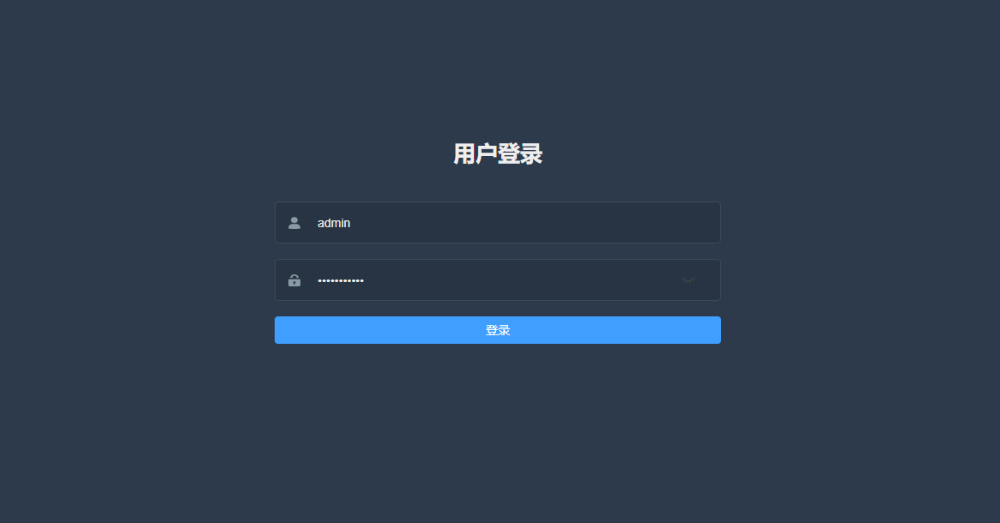

# django-vue3

## 前端

```
npm install --registry=https://registry.npm.taobao.org
npm run serve
```

打包

```
npm run build
```


## 后端

```
pip3 install -r requirements.txt
python3 manage.py runserver 0.0.0.0:8888

```

## 演示图

